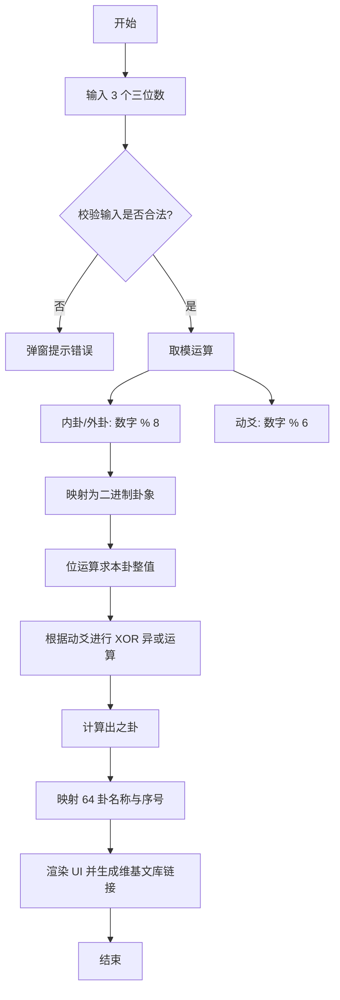

# 数字卦起卦器 (Digital Divination Tool)

一个基于单 HTML 文件的轻量级起卦工具。用户输入三个三位数字，程序根据传统的“梅花易数”数字起卦逻辑，计算出**本卦**、**动爻**及**之卦**，并自动链接至维基文库查看详细卦辞。

---

## 核心逻辑流程

该程序遵循输入校验、余数计算、位运算求变卦、结果映射四个步骤。

---

## 二进制计算方法详解

程序的核心亮点在于使用**二进制位运算**来处理卦象的变换。

### 1. 基础映射 (先天八卦数)
八卦被映射为 3 位二进制数（阳爻为 1，阴爻为 0）：
| 卦名 | 十进制 | 二进制 (高位到低位对应初爻到上爻) |
| :--- | :--- | :--- |
| 乾 | 7 | `111` |
| 兑 | 3 | `011` |
| 离 | 5 | `101` |
| 震 | 1 | `001` |
| 巽 | 6 | `110` |
| 坎 | 2 | `010` |
| 艮 | 4 | `100` |
| 坤 | 0 | `000` |

### 2. 合并本卦
本卦由外卦（上）和内卦（下）组成，通过左移运算 `<<` 合并成一个 6 位的二进制数：
- **公式**：`res1 = (外卦二进制 << 3) | 内卦二进制`
- **示例**：外卦为乾 (111)，内卦为坤 (000)，合并后为 `111000`。

### 3. 动爻变换 (求之卦)
之卦是通过改变本卦中某一个爻的阴阳（0 变 1，1 变 0）得到的。程序使用 **XOR (异或)** 运算实现：
1. **生成掩码 (Mask)**：将 `1` 左移 `(动爻 - 1)` 位。例如动爻为 3，掩码为 `000100`。
2. **异或运算**：`res2 = res1 ^ Mask`。
   - 如果对应位是 `1`，`1 ^ 1 = 0` (阳变阴)
   - 如果对应位是 `0`，`0 ^ 1 = 1` (阴变阳)

### 4. 解析之卦
通过位移 `>> 3` 取出高三位（新外卦），通过与运算 `& 0b111` 取出低三位（新内卦），最后从预设的 `name64` 矩阵中检索卦名。

---

## 功能特性

* **纯前端实现**：无需服务器，单个 HTML 文件即可运行，响应极快。
* **输入限制**：通过正则与 HTML 属性强制要求输入 3 位数字，确保计算严谨。
* **移动端优化**：包含 `viewport` 适配，禁止数字框上下箭头，适合手机操作。
* **自动化查询**：点击卦名直接跳转至《周易》对应的文库页面，方便查阅卦爻辞。

---

## HTML结构说明

* `panel-1`: 输入控制区。
* `panel-2`: 数字计算结果反馈区（显示余数与单卦名）。
* `panel-3`: 核心结果展示区，包含本卦与之卦的对比、序号及百科链接。
